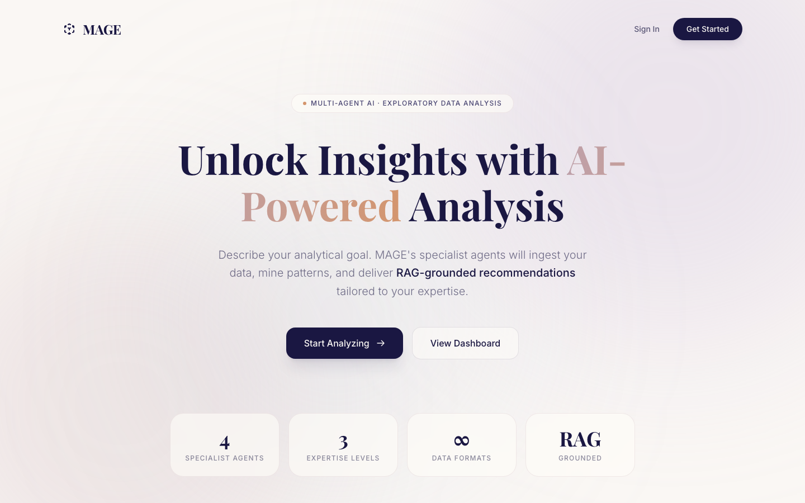
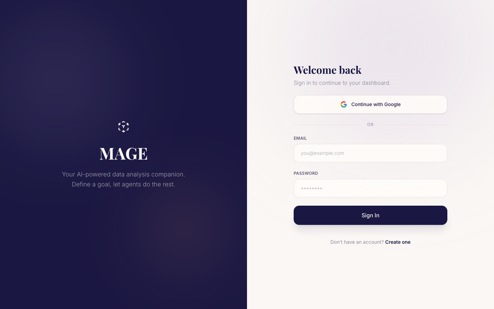
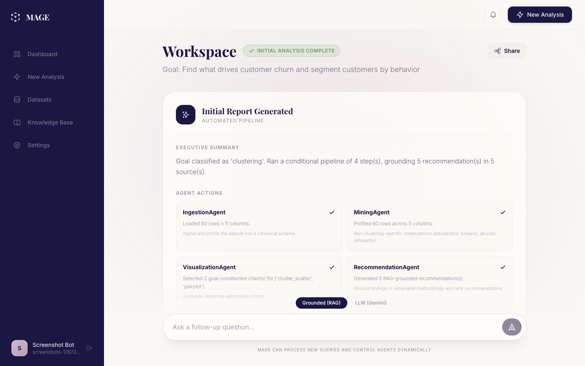
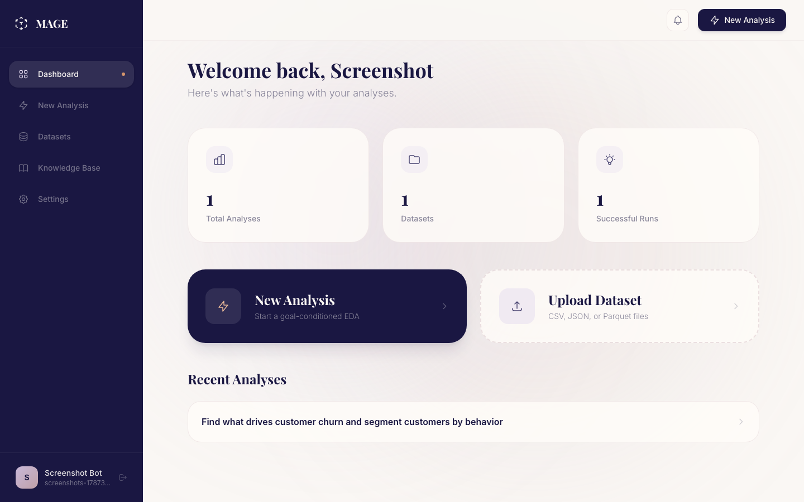
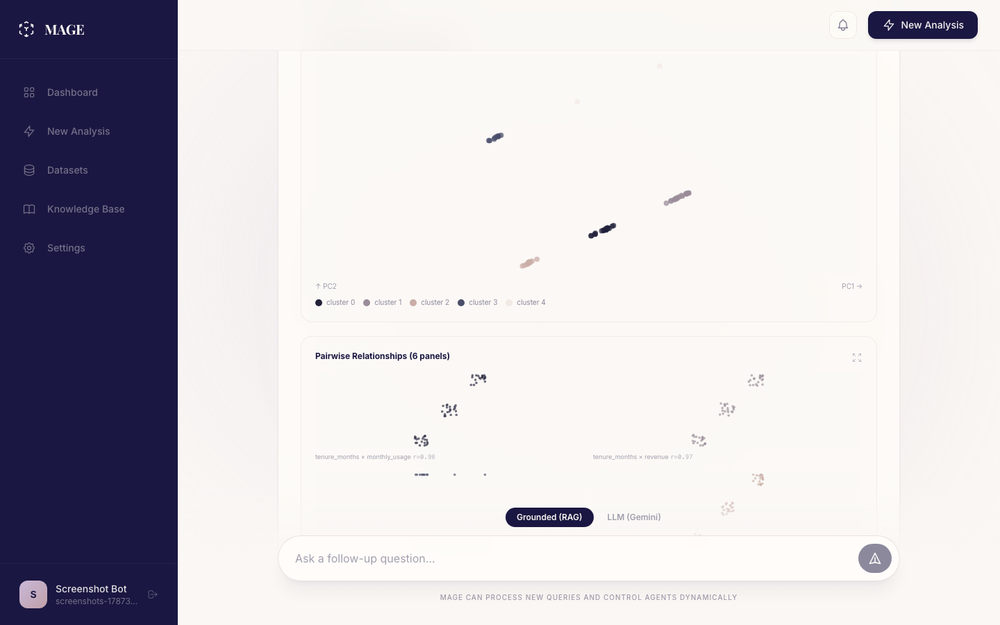
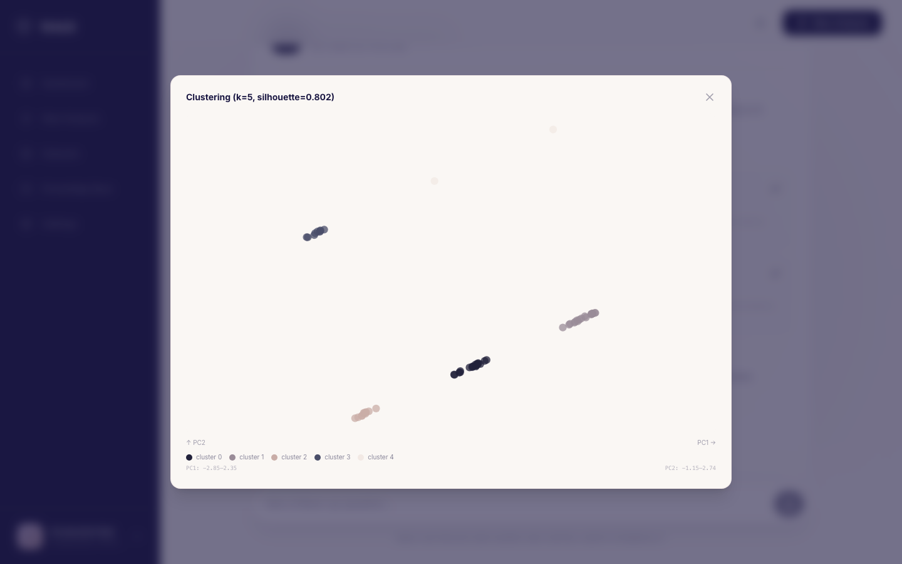

# 🧙 MAGE — Multi-Agent Goal-conditioned EDA

> **Upload data. State a goal. Get RAG-grounded, explainable recommendations.**

MAGE is a multi-agent AI system for exploratory data analysis. You upload a
dataset (or pick a sample), describe what you're trying to figure out in
plain English, and a small pipeline of specialist agents ingests, profiles,
visualizes, and explains the data back to you — with every recommendation
grounded in a retrievable methodology source, not just an LLM's opinion.

**Live app:** https://frontend-production-6d15.up.railway.app

---

## Screenshots

| | |
|---|---|
|  |  |
| Landing page | Sign in |
|  |  |
| Analysis workspace — agent pipeline, executive summary | Dashboard |
|  |  |
| Goal-conditioned charts (cluster scatter, pairplot) | Click-to-enlarge chart view |

---

## What it does

- **Goal-conditioned pipeline** — a goal classifier reads your question
  ("find outliers in revenue", "what drives churn?", "summarize this
  dataset") and a planner builds a conditional sequence of agent steps
  instead of always running the same fixed pipeline.
- **Real ingestion** — CSV, JSON, Parquet, Excel, TSV, with schema
  inference, delimiter detection, and data-quality profiling
  (completeness, uniqueness, missingness) on load.
- **Statistical mining** — descriptive stats, correlation, outlier
  detection (IQR), distribution shape, feature importance (PCA loading),
  clustering (DBSCAN), and SHAP-based feature attribution.
- **Goal-conditioned charts** — histograms, bar/grouped-bar, box plots,
  correlation heatmaps, cluster scatter plots, pairplots, violin plots,
  line charts — rendered as dependency-free SVG, each click-to-enlarge
  with axis labels.
- **RAG-grounded recommendations** — every recommendation cites a source
  chunk from a knowledge base of methodology notes (clustering, outlier
  detection, regression diagnostics, data leakage, class imbalance, etc.),
  retrieved via a FAISS/Chroma vector store, and rewritten for the
  reader's stated expertise level (technical / analyst / plain-language).
- **Follow-up conversations** — ask a follow-up question and it re-runs
  the pipeline goal-conditioned on the new question, threaded onto the
  same conversation (`root_run_id`), so a reload rebuilds the full thread.
- **Public sharing** — share a whole conversation as a read-only public
  link; unsharing invalidates it immediately.
- **Dataset workspace** — versioned transforms, an ad-hoc SQL-over-
  DataFrame query console, and natural-language-to-SQL querying.
- **Exports** — PDF report, full JSON run export, and a BibTeX citation
  bundle for every knowledge-base source cited in a run.
- **Auth** — email/password (JWT access + refresh tokens) and Google
  OAuth sign-in.

---

## Architecture

```
┌───────────────────────────────────────────────────────────────────────┐
│  Frontend — Next.js 16 (App Router, Turbopack) + React 19 + Tailwind  │
│  Auth pages · Dashboard · Analysis workspace · Datasets · Public share │
└──────────────────────────────┬──────────────────────────────────────┘
                                │ REST / HTTP (JWT bearer)
┌──────────────────────────────▼──────────────────────────────────────┐
│  Backend — FastAPI + Pydantic v2                                     │
│  routers: auth · oauth · analysis · health                           │
└──────────────────────────────┬──────────────────────────────────────┘
                                │
┌──────────────────────────────▼──────────────────────────────────────┐
│  Agents — OrchestratorAgent (observe → replan ReAct loop)            │
│                                                                        │
│  GoalClassifier → PipelinePlanner → IngestionAgent → MiningAgent      │
│                 → VisualizationAgent → RecommendationAgent            │
│                                                                        │
│  QAAgent (direct computed answers)   ExplainAgent (LLM deep-dives)    │
└──────────┬─────────────────────────────────────┬─────────────────────┘
           │ pandas                              │ RAG
┌──────────▼──────────────┐        ┌─────────────▼─────────────────────┐
│  Data Pipeline           │        │  RAG Pipeline                     │
│  IngestionEngine         │        │  VectorStore (FAISS / Chroma)     │
│  ProcessingEngine        │        │  embeddings · KnowledgeBaseLoader │
└──────────────────────────┘        └────────────────────────────────────┘
                                │
┌───────────────────────────────▼──────────────────────────────────────┐
│  Postgres — users, analysis runs (threaded + shareable), datasets     │
└─────────────────────────────────────────────────────────────────────┘
```

---

## Folder Layout

```
MAGE/
├── agents/                       # Orchestrator + specialist agents
│   ├── orchestrator.py           # OrchestratorAgent (observe/replan ReAct loop)
│   ├── goal_classifier.py        # Goal → structured task type
│   ├── planner.py                # Conditional pipeline construction
│   ├── ingestion_agent.py        # IngestionAgent
│   ├── mining_agent.py           # MiningAgent (stats, outliers, clustering)
│   ├── visualization_agent.py    # VisualizationAgent (chart spec selection)
│   ├── recommendation_agent.py   # RecommendationAgent (RAG-grounded)
│   ├── qa_agent.py               # Direct computed-answer short-circuit
│   ├── explain_agent.py          # LLM-synthesized deep explanations
│   └── llm_client.py             # Gemini client wrapper
│
├── backend/                      # FastAPI application
│   ├── main.py                   # App entry point
│   ├── core/config.py            # Pydantic Settings (env-driven)
│   ├── routers/                  # auth, oauth, analysis, health
│   ├── services/                 # orchestrator_service, analysis_run_service, ...
│   ├── models/                   # SQLAlchemy models
│   ├── schemas/                  # Pydantic request/response models
│   ├── Dockerfile                # Multi-stage Python image (repo-root build context)
│   └── pyproject.toml            # Dependencies + build config
│
├── frontend/                     # Next.js 16 application
│   ├── app/
│   │   ├── page.tsx              # Landing page
│   │   ├── signin/ signup/       # Auth pages
│   │   ├── dashboard/            # Analysis workspace, datasets, knowledge base
│   │   ├── share/[runId]/        # Public read-only conversation view
│   │   └── components/           # Chart primitives, cards, shared UI
│   └── Dockerfile                # Multi-stage Node image (standalone output)
│
├── rag/                          # RAG pipeline
│   ├── vector_store.py           # VectorStore (FAISS / Chroma)
│   ├── embeddings.py             # embed_text() / embed_batch()
│   └── knowledge_loader.py       # KnowledgeBaseLoader
│
├── data_pipeline/                # Ingestion + processing engines
│   ├── ingestion.py               # DataIngestionEngine (CSV/JSON/Parquet/Excel/TSV)
│   └── processing.py              # DataProcessingEngine (pandas)
│
├── data/
│   ├── knowledge_base/           # Methodology sources the RAG store retrieves from
│   └── samples/                  # Built-in sample datasets
│
├── evaluation/                    # Offline evaluation harness + baseline metrics
├── scripts/                       # generate_sample_dataset.py, generate_project_report.py
├── tests/                         # pytest — backend, agents, rag, data_pipeline
├── docs/                          # architecture.md, api_contracts.md, build logs
├── infra/k8s/                     # Kubernetes manifests
│
├── .env.example                   # Environment variable template
├── docker-compose.yml              # Full local dev stack (backend + frontend + Postgres)
└── railway.json                    # Railway deploy config (backend Dockerfile + healthcheck)
```

---

## Quick Start — Local Development

### Prerequisites

- Python 3.11+
- Node.js 20+
- Postgres (or Docker, to run it in a container)
- A Gemini API key (for LLM-mode chat and explanations — the RAG path works without one)

### 1. Clone & configure

```bash
git clone <repo-url>
cd MAGE
cp .env.example .env
# Edit .env — at minimum set GEMINI_API_KEY, JWT_SECRET_KEY, SESSION_SECRET_KEY,
# and DATABASE_URL if not using docker compose's Postgres.
```

### 2. Backend

```bash
cd backend
python -m venv .venv
source .venv/bin/activate          # Windows: .venv\Scripts\activate
pip install -e ".[dev]"

cd ..
PYTHONPATH=. uvicorn backend.main:app --reload --port 8000

curl http://localhost:8000/health
```

### 3. Frontend

```bash
cd frontend
npm install
npm run dev
# Open http://localhost:3000
```

### 4. Full stack via Docker Compose

```bash
# From the repo root
docker compose up --build

# Services:
#   Backend   → http://localhost:8000  (API docs at /docs)
#   Frontend  → http://localhost:3000
#   Postgres  → localhost:5432
```

### Google OAuth (optional)

Set `GOOGLE_CLIENT_ID` / `GOOGLE_CLIENT_SECRET` in `.env`, and make sure
`BACKEND_URL` in your environment exactly matches an "Authorized redirect
URI" in Google Cloud Console (`BACKEND_URL` + `/auth/google/callback`) — a
mismatch here is the most common cause of OAuth silently failing.

---

## Running Tests

```bash
# Backend + agents + rag + data_pipeline tests (from repo root)
cd backend && pip install -e ".[dev]" && cd ..
PYTHONPATH=. pytest tests/ -q

# Frontend
cd frontend
npx tsc --noEmit
npm run lint
npm run build
```

---

## Deployment

Deployed on [Railway](https://railway.com) as three services: `backend`
(FastAPI, Dockerfile at `backend/Dockerfile`, repo-root build context per
`railway.json`), `frontend` (Next.js, standalone output), and a managed
Postgres instance. `NEXT_PUBLIC_*` variables are baked into the frontend
at **build time** — set them as Railway build-time variables, not just
runtime ones, or the client bundle won't pick them up.

```bash
railway up --service backend --detach
railway up frontend --path-as-root --service frontend --detach
```

---

## Tech Stack

| Layer | Technology |
|---|---|
| Backend | Python 3.11, FastAPI, Pydantic v2, SQLAlchemy, Uvicorn |
| Frontend | Next.js 16 (Turbopack), React 19, TypeScript, Tailwind CSS 4 |
| Auth | JWT (access + refresh), Google OAuth 2.0 |
| Database | PostgreSQL |
| Agents | Custom observe/replan ReAct loop |
| LLM | Google Gemini (chat mode + explanations) |
| Vector Store | FAISS (local) / ChromaDB |
| Data Processing | pandas, scikit-learn, SHAP, DuckDB (SQL console) |
| Containerization | Docker + docker-compose; deployed on Railway |
| Testing | pytest (backend/agents/rag), TypeScript strict mode (frontend) |

---

## Contributing

1. Create a feature branch: `git checkout -b feat/my-feature`
2. Commit your changes: `git commit -m "feat: add X"`
3. Push and open a pull request against `main`
