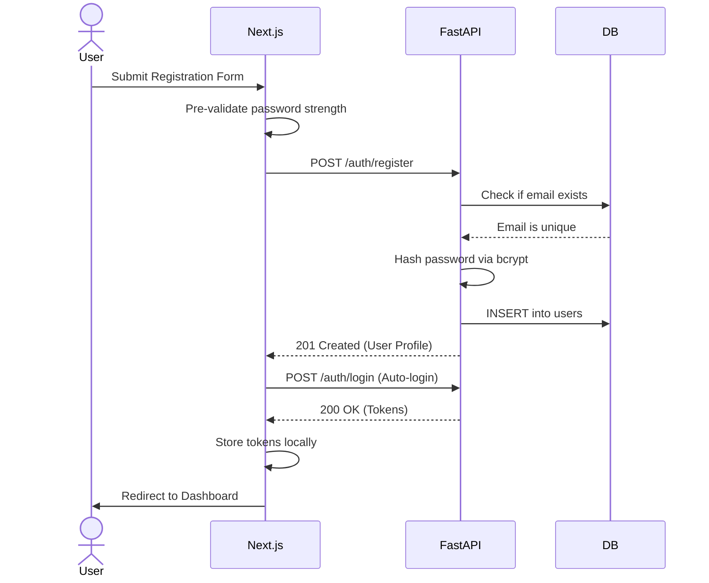
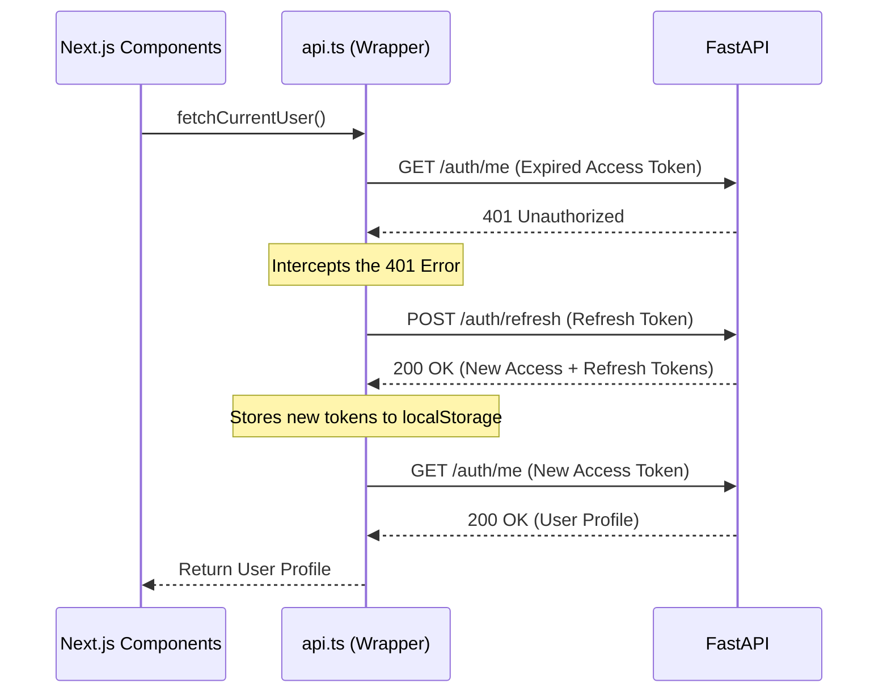

# MAGE Authentication & Authorization Module

This document outlines the architecture, security practices, and workflows for the authentication module built into the MAGE platform.

## Overview
The authentication system is a stateless JWT-based (JSON Web Token) architecture. It relies on a decoupled frontend (Next.js) and backend (FastAPI) communicating via standard REST APIs.
* **Database:** SQLite (local development) via SQLAlchemy Async ORM.
* **Password Hashing:** `bcrypt` (passwords are strictly never stored in plain text).
* **Token Management:** `python-jose` for generating short-lived access tokens and long-lived refresh tokens.
* **State Management (Frontend):** Tokens stored securely in `localStorage` with a custom `apiFetch` wrapper for automatic authenticated requests.

---

## High-Level Architecture Diagram

```mermaid
graph TD
    subgraph Frontend [Next.js Client]
        UI[Sign In / Register UI]
        API[api.ts Wrapper]
        Storage[(localStorage)]
    end

    subgraph Backend [FastAPI Server]
        AuthRouter[/auth/* Endpoints]
        SecModule[Security Module - bcrypt/JWT]
        DB[(SQLite - mage.db)]
    end

    UI -->|1. Credentials| API
    API -->|2. POST /auth/login| AuthRouter
    AuthRouter <-->|3. Validate| SecModule
    AuthRouter <-->|4. Query User| DB
    AuthRouter -->|5. Access + Refresh JWT| API
    API -->|6. Save tokens| Storage
```

---

## Security Highlights
1. **Password Complexity Validation:** Enforced both on the frontend (visual cues) and backend (Pydantic validation). Requires uppercase, lowercase, numbers, and special characters.
2. **Constant-Time Comparison:** Login attempts use constant-time hashing verification to prevent timing side-channel attacks.
3. **Generic Error Messages:** Failed logins return *"Invalid email or password"* rather than confirming if an email exists in the database, preventing enumeration attacks.
4. **Token Segregation:** 
   * **Access Tokens** (30 mins) have a `type: "access"` claim.
   * **Refresh Tokens** (7 days) have a `type: "refresh"` claim.
   * *Security Feature:* The backend explicitly rejects refresh tokens if they are passed in the `Authorization: Bearer` header for normal endpoints.

---

## API Endpoints

| Method | Endpoint | Description | Auth Required |
|--------|----------|-------------|---------------|
| `POST` | `/auth/register` | Creates a new user account. Returns user profile (no password). | No |
| `POST` | `/auth/login` | Validates credentials and returns JWT token pair. | No |
| `POST` | `/auth/refresh`| Accepts a refresh token, returns a fresh pair of tokens. | No |
| `GET`  | `/auth/me` | Returns the profile of the currently logged-in user. | **Yes (Bearer)** |

---

## Application Workflows

### 1. Registration Flow


### 2. Auto-Refresh Token Flow (Frontend Interceptor)
The `apiFetch` utility in the frontend automatically intercepts `401 Unauthorized` errors and seamlessly refreshes the session without user interruption.



---

## Database Schema (User Table)
| Column | Type | Constraints | Description |
|--------|------|-------------|-------------|
| `id` | VARCHAR(36) | Primary Key | UUIDv4 string |
| `email` | VARCHAR(320)| Unique, Indexed | User's email |
| `full_name` | VARCHAR(200)| Not Null | Display name |
| `hashed_password` | VARCHAR(128)| Not Null | bcrypt hash |
| `is_active` | BOOLEAN | Default: True | Can log in? |
| `created_at`| DATETIME | Not Null | Creation timestamp |
| `updated_at`| DATETIME | Not Null | Last update timestamp |
